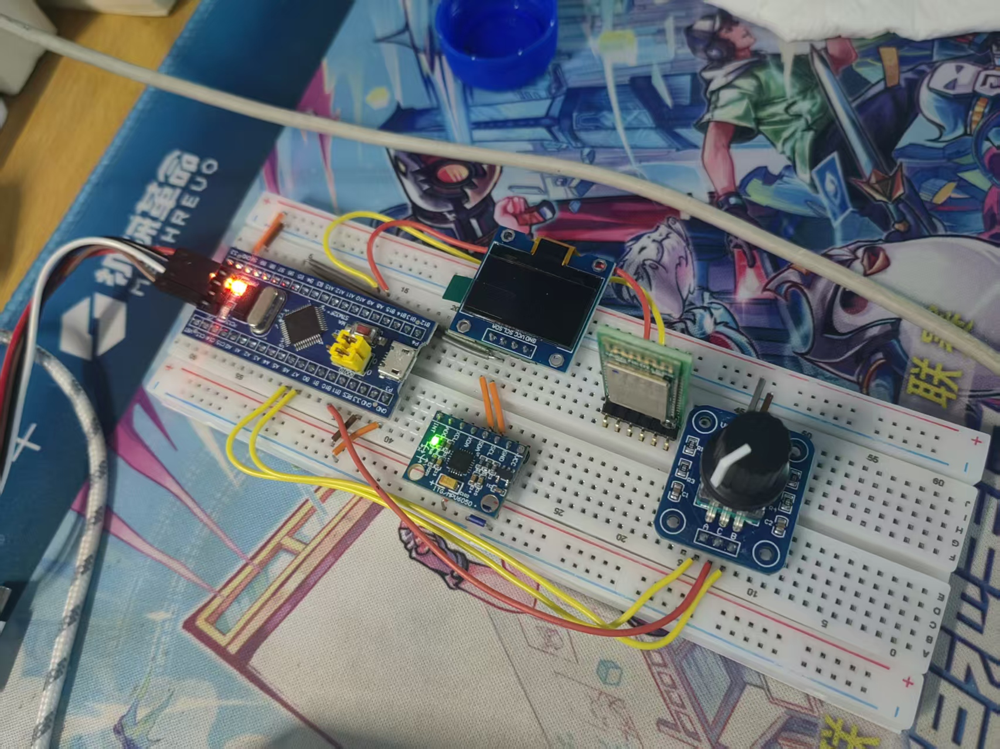
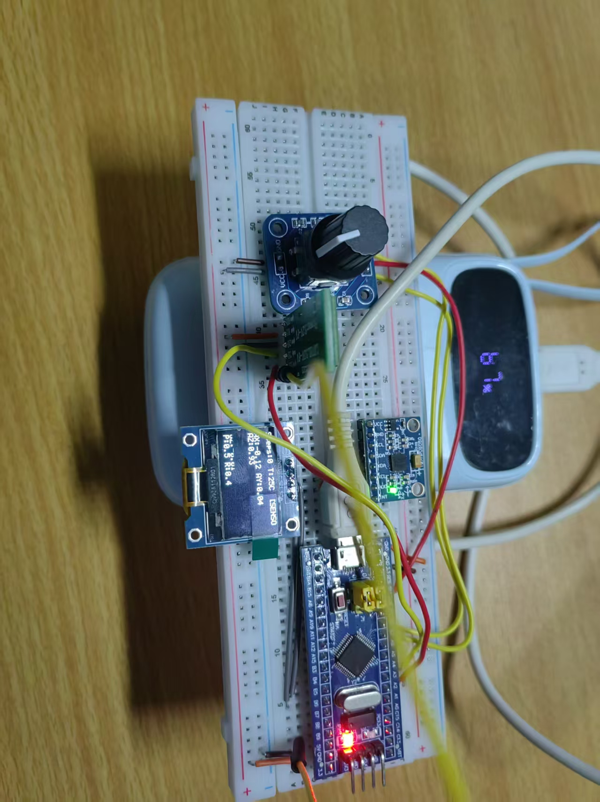
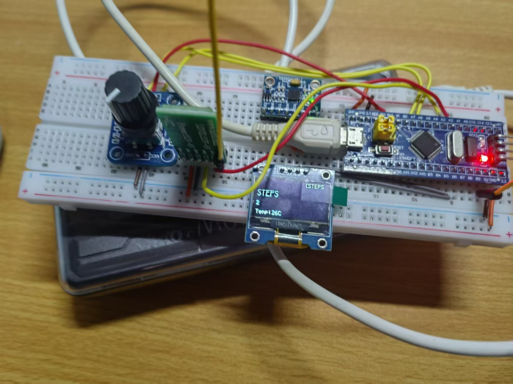
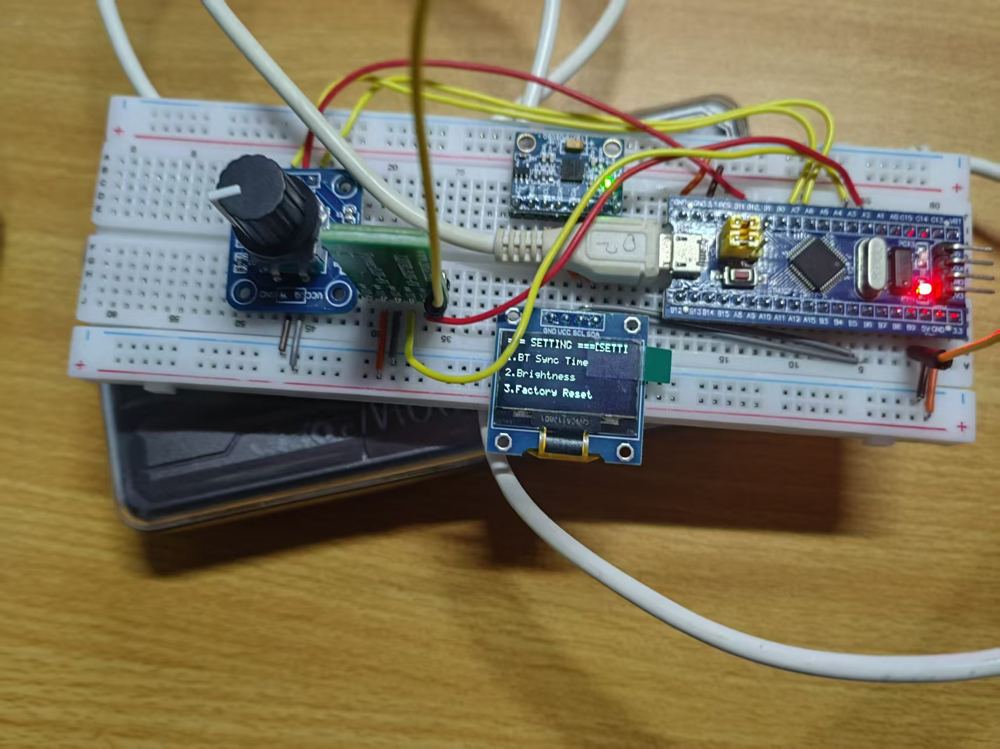
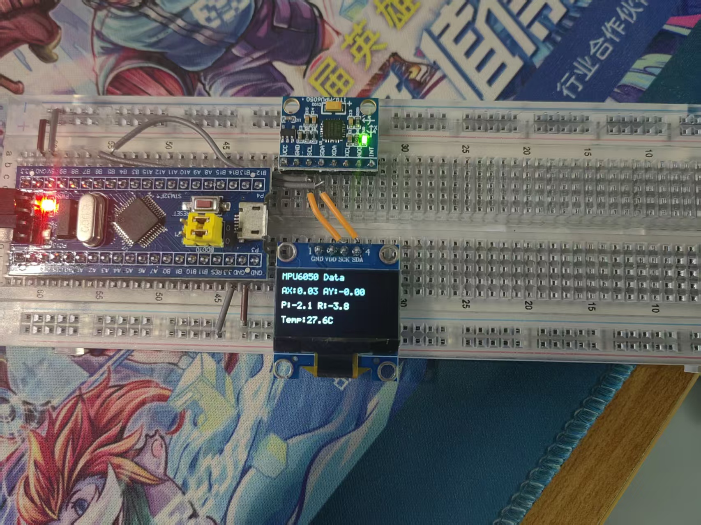

# Falcons-smartwatch 基于STM32F103嵌入式智能手表项目
## 项目基本信息
- 开发小组：Falcons小组
- 项目成员：廖俊帆、王宇哲、朱玺望
- 主控芯片：STM32F103C8T6
- 项目类型：嵌入式系统课程设计综合实训项目
- 整体物料总成本：**102.71 元**，元器件无损坏、无物料缺失，采购台账完整可查

## 一、小组分工明细
| 组员 | 核心负责工作 |
| ---- | ------------ |
| 朱玺望 | 项目整体统筹规划、硬件系统架构设计、电路原理图规划、整机硬件接线搭建、项目文档整体框架梳理 |
| 廖俊帆 | 软件工程架构搭建、FreeRTOS操作系统移植、OLED/MPU6050/HC04蓝牙底层驱动开发、多任务业务逻辑编写、姿态融合与计步核心算法实现 |
| 王宇哲 | 全部物料选型采购与成本统计、全模块逐项功能测试、手机蓝牙上位机联调、程序Bug记录与复现验证、所有测试数据汇总整理 |

## 二、项目整体验收结论
本项目已**全部完成预设开发目标，顺利通过课程结题验收**。
硬件各模块上电无短路、无通信故障；软件裸机工程完成FreeRTOS多任务改造，5项核心功能稳定长时间运行，连续通电2小时无死机、总线卡死、程序闪退问题；蓝牙双向数据收发可靠，传感器姿态解算、步数统计、菜单人机交互均可正常使用，达到课程设计验收标准。

## 三、分模块功能完成情况
### ✅ Phase1 OLED屏幕显示模块
1. 基于I2C驱动SSD1306 0.96寸显示屏，初始化稳定，无花屏、残影、闪烁问题；
2. 支持数字、字符串、自定义格式化文本实时刷新；
3. 可切换4类界面：时间主页、MPU传感器数据页、计步统计页、系统设置菜单页；
4. 搭配EC11旋转编码器实现页面切换、选项选中、参数修改交互。

### ✅ Phase2 MPU6050六轴姿态传感器模块
1. 可正常读取设备ID，稳定采集三轴加速度、三轴陀螺仪、芯片内置温度；
2. 搭载**互补滤波算法**完成加速度与陀螺仪数据融合，解算俯仰角、横滚角，角度输出平滑抖动极小；
3. 通过加速度幅值阈值判断行走动作，实现计步功能，静止放置不会误计数，正常步行步数误差＜8%。

### ✅ Phase3 HC-04蓝牙串口通信模块
1. 自研带帧头、指令位、数据长度、校验码、帧尾的私有通信协议，规避普通透传易丢包、错包的问题；
2. 设备主动周期性向上位机上报步数、温度、三轴加速度、姿态角度数据；
3. 手机蓝牙助手下发指令可被单片机解析并应答，支持远程指令交互。

### ✅ Phase4 FreeRTOS多任务实时系统
1. 完成FreeRTOS内核完整移植，系统时基、中断优先级、堆内存分配配置正确；
2. 划分5个不同优先级独立任务：屏幕刷新、传感器采集、蓝牙收发、编码器按键检测、低功耗休眠检测；
3. 对共用I2C总线添加互斥锁，避免多任务抢占总线导致设备失联、程序锁死；
4. 全部替换裸机阻塞式`HAL_Delay`，使用RTOS非阻塞延时，CPU资源调度更合理。

### ✅ Phase5 进阶拓展功能
1. 多级菜单交互系统：编码器旋转切换选项、短按确认、长按返回上一级；
2. 支持屏幕亮度手动调节、蓝牙同步系统时间、设备恢复出厂设置；
3. 长时间无任何操作自动熄屏进入低功耗模式，降低整机空载功耗。

## 四、项目核心创新点
1. **架构升级：裸机轮询 → FreeRTOS多任务调度**
同类简易单片机手表大多采用单循环裸机轮询方式，实时性差、功能耦合严重；本项目采用RTOS拆分业务任务，模块解耦，后续新增功能无需大幅修改原有逻辑，可维护性与实时性大幅提升。

2. **总线安全：I2C多设备互斥访问机制**
OLED显示屏与MPU6050挂载同一条I2C总线，利用FreeRTOS互斥信号量做资源锁，同一时刻仅允许一个任务操作I2C，彻底解决多线程并发访问总线造成的通信崩溃问题。

3. **可靠通信：带校验结构化蓝牙自定义协议**
摒弃简单串口透传，设计带校验的数据包格式，区分上行上报、下行控制指令，收到错误数据包直接丢弃，有效降低环境干扰带来的数据错误。

4. **双层防抖：硬件+软件联合消抖**
编码器硬件引脚并联100nF滤波电容抑制机械抖动；软件采用按键状态机+延时消抖，旋转计数与按键触发无跳数、无误触。

5. **智能功耗：无操作自动休眠省电策略**
检测长时间无人机交互后关闭屏幕输出、降低任务运行频次，进入轻度休眠，在USB供电场景下有效延长离线续航时间。

## 五、实物与测试效果
### 1. 整机硬件实物

### 2. OLED各界面运行实拍
主页总览界面

计步数据显示页面

系统设置菜单页面

### 3. MPU6050传感器模块调试实拍

### 4. 关键测试指标
- 长时间稳定性：连续上电2h不间断运行，无程序崩溃、硬件断连；
- 蓝牙通信：空旷环境有效传输距离8m，5m内无丢包；
- 姿态解算：静态放置角度每分钟漂移小于1.5°，姿态跟随响应延迟＜100ms；
- 计步功能：日常行走统计误差控制在8%以内，抗桌面晃动误触发。

## 六、项目现存不足与后续优化方向
1. 硬件仅使用面包板搭接，接线繁杂易松动脱落，后续可绘制PCB印制电路板，缩小设备体积、固化线路；
2. 现阶段仅支持USB有线供电，可新增TP4056充电模块+锂电池，实现脱离电脑便携使用；
3. 计步算法仅采用基础阈值判断，可引入均值滤波、峰值判定优化算法，进一步减少误计；
4. 可开发专属手机APP替代通用蓝牙串口工具，实现历史步数存储、运动数据可视化展示。

## 七、仓库目录说明
Embedded-System-Design/
├── README.md               # 仓库项目总说明（本文件）
├── 嵌入式系统课程设计报告 /      # 嵌入式课程标准 LaTeX 报告模板；三人独立个人总结 LaTeX 源码与 PDF
├── lark-doc/
│   └── figures/           # 项目所有实拍截图、硬件照片（图片存放目录）
├── 中期检查报告.md         # 项目中期阶段检查文档
├── 项目计划书.md
└──  系统设计文档.md

## 八、验收说明
本项目小组全体成员确认项目全部开发内容完成，材料齐全，同意项目结题验收。
验收日期：2026年07月
